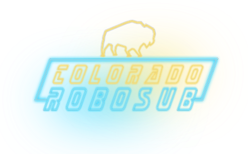

# About

This is the software documentation for the Colorado RoboSub team. It was created with VitePress, a wordpress template. The GitHub for the robot source code can be found [here](https://github.com/CU-Robosub/cusub2.1). If there are any inqueries, please reach out to `robosub@colorado.edu` or `jakob.tucker@colorado.edu` for assistance.

